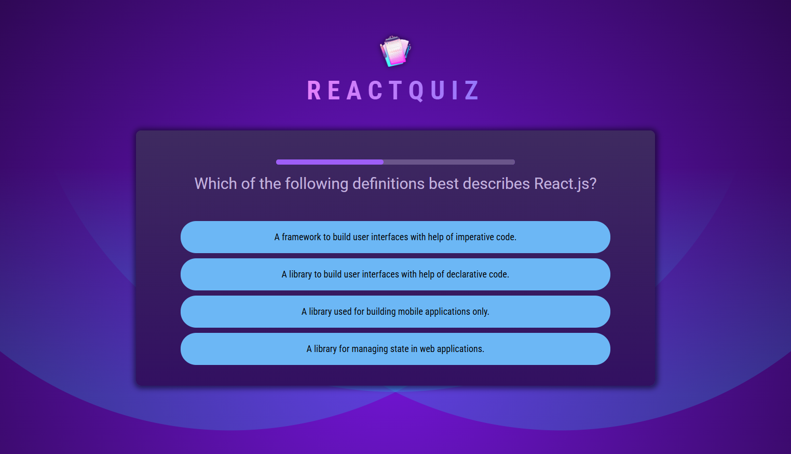
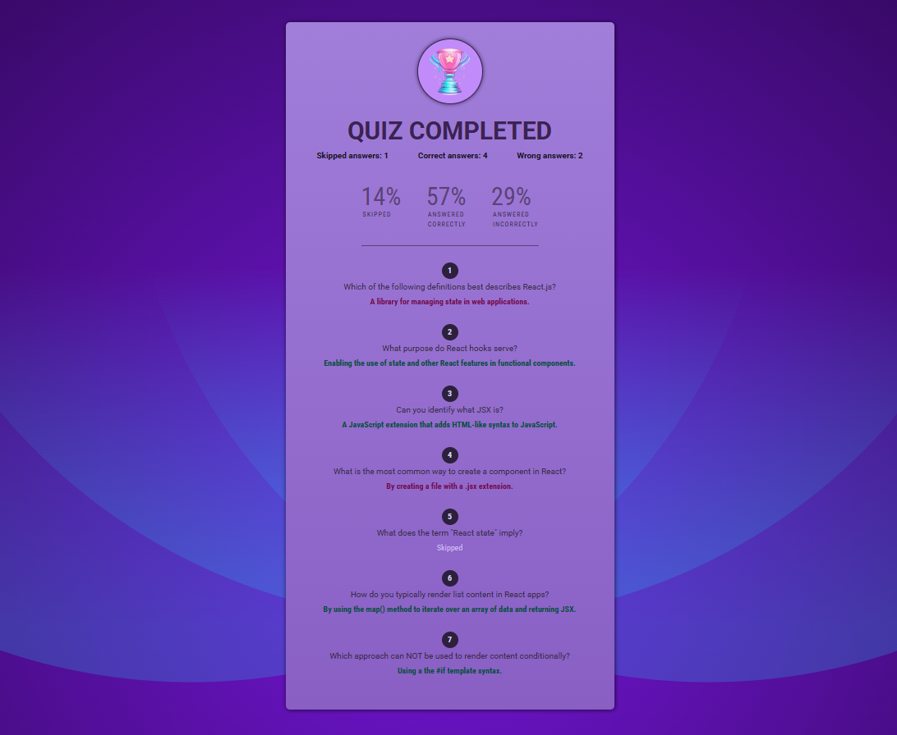

# 🏆 React Quiz


A simple React Quiz App that allows users to answer shuffled questions under a timer, and provides a summary of correct, wrong, and skipped answers.

---

## 📝 Features

- Shuffle questions for each quiz attempt
- Timer for each question
- Track user answers: correct, wrong, skipped
- Display summary at the end with percentages

##### Note: Minimal styling; main focus is on React logic and functionality.

---

## 💻 Tech Stack

- **React** (functional components, useState, useRef)
- **JavaScript (ES6+)**
- **CSS3/Styling**
- **Vite** (for development and build)

---

## 📂 Project Structure

```text
src/
├─ assets/
│  ├─ screenshots/
│  │  ├─ quiz-question.png
│  │  └─ quiz-summary.png
|  ├─ quiz-logo.png
│  └─ quiz-complete.png
├─ components/
│  ├─ Answers.jsx
│  ├─ Header.jsx
│  ├─ Question.jsx
│  ├─ QuestionTimer.jsx
│  ├─ Quiz.jsx
│  └─ Summary.jsx
├─ App.jsx
├─ index.css
├─ main.jsx
```

---

## ⚙️ Installation & Usage

Clone the repository, install dependencies, and start the development server:

```bash
git clone git@github.com:smadi2512/react-quiz-app.git React-Quiz
cd React-Quiz
npm install
npm run dev
```

Open your browser at http://localhost:5173 (Vite default).

---

## 📸 Screenshots

| Quiz Question | Quiz Summary |
|---------------|--------------|
|  |  |

---

## 📈 Future Improvements

- Persistent scores with localStorage
- Multiple quizzes with categories
- Animations and enhanced UI

---

## 👩‍💻 Author

Created by **Walaa Smadi**✨ \
Based on a tutorial/course, but all work, styling, and enhancements were done independently.

- GitHub: [@smadi2512](https://github.com/smadi2512)
- LinkedIn: [Walaa Smadi](https://www.linkedin.com/in/walaa-bilal-smadi/)

Feel free to fork, star ⭐, and contribute!
